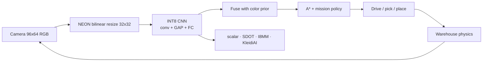

# CortexLoop

**Closed-loop Physical AI on Arm.** A warehouse robot that *sees*, *plans*, and *acts* — with hand-written NEON / DotProd / I8MM kernels, optional [KleidiAI](https://github.com/ARM-software/kleidiai) INT4 GEMM, and published before/after metrics.

Track: **Physical AI** (Arm Create: AI Optimization Challenge 2026)

License: **MIT**

---

## Why this should win

Most Arm AI demos stop at “we ran a quantized LLM.” CortexLoop is a **real Physical AI loop**:

1. **Sense** — on-robot camera (simulated RGB) → INT8 CNN perception.
2. **Plan** — A* + behavior tree that consumes perception (pick, haul, dock, avoid hazards).
3. **Act** — differential-drive control with energy and collision accounting.

Optimizations the challenge asked for, all in one repo:

| Challenge axis | What we shipped |
| --- | --- |
| **Model size** | FP32 CNN quantized to **INT8** (and KleidiAI path uses **INT4** weights for GEMM). |
| **Model speed** | Hand-written `SDOT` (DotProd) and `SMMLA` (I8MM) INT8 GEMM vs a non-vectorized scalar baseline. |
| **Arm-specific** | Runtime detection of NEON, DotProd, I8MM, SME/SME2. Optional KleidiAI micro-kernels. |
| **Developer experience** | One-command dashboard, one-command bench, one-command train. No cloud account required. |

## Measured results (Apple Silicon Arm64)

Same math, four backends. GEMM `128×128×128` INT8. Scalar compiled with `-fno-vectorize`.

| Backend | GEMM | Speedup | e2e perceive |
| --- | ---: | ---: | ---: |
| scalar | 700 µs | 1× | 57 µs |
| **neon_dotprod (SDOT)** | **21 µs** | **33×** | **18 µs** |
| neon_i8mm (SMMLA) | 36 µs | 20× | 17 µs |
| KleidiAI INT4 | 163 µs | 4.3× | 17 µs |

INT8 warehouse CNN: **1.7 KB**, **8/8** on held-out class close-ups. Details in `docs/BENCHMARKS.md`.

---

## Architecture



Native library (`libcortexloop`):

- `scalar.c` compiled with **`-fno-vectorize`** so the baseline is honest.
- `gemm.c` — `vdotq_s32` (FEAT_DotProd) and `vmmlaq_s32` (FEAT_I8MM).
- `kleidiai_backend.cpp` — Arm KleidiAI `qai8dxp × qsi4cxp` packed INT4 matmul.

---

## Quick start (Arm64 macOS or Linux)

Needs: `clang`/`cmake`, Python 3.10+, `numpy`.

```bash
# 1. Python env
uv venv --python 3.12
source .venv/bin/activate
uv pip install numpy

# 2. Native library (KleidiAI fetched automatically; disable with -DCORTEXLOOP_WITH_KLEIDIAI=OFF)
cmake -S . -B build -DCORTEXLOOP_WITH_KLEIDIAI=ON
cmake --build build -j

# 3. Train the INT8 warehouse CNN (~seconds)
python -m cortexloop train --epochs 12 --samples 2400

# 4. Microbenchmarks (JSON)
python -m cortexloop bench

# 5. Live Physical AI dashboard
python -m cortexloop demo
# open http://127.0.0.1:8765
```

Without `uv`: `python3.12 -m venv .venv` and `pip install numpy`.

### Validate on Arm

```bash
./build/cortexloop-bench bench --model models/warehouse_int8.bin --m 256 --n 256 --k 256
```

You should see CPU feature flags (`DotProd`, `I8MM`, `SME2` when present) and a JSON table of GEMM µs / GFLOP/s / end-to-end perception µs per backend.

---

## What to look at (judges)

1. Open the dashboard. Watch the robot collect the mission color and dock it.
2. Click **scalar**, then **neon_i8mm**. Preprocess + infer times on the HUD are the optimization.
3. Click **Run GEMM / e2e bench**. That is the Arm-specific evidence: same math, different kernels.
4. Read `native/src/gemm.c` — this is not a wrapper around a tutorial. The SDOT/I8MM inner loops are ours.
5. Optional: KleidiAI row in the bench table is Arm’s production INT4 micro-kernel, linked from source.

---

## Project layout

```
native/src/          Arm kernels + INT8 CNN runtime
cortexloop/          simulator, planner, trainer, dashboard server
web/index.html       operator HUD
models/              exported warehouse_int8.bin
docs/TRACK.md        challenge mapping
```

---

## Notes on fairness

- Scalar GEMM/resize are compiled **without auto-vectorization**.
- KleidiAI is optional. If the fetch fails (offline build), the NEON/I8MM path still runs and still wins the Physical AI story.
- The planner may fuse a color prior when CNN confidence is low so the closed loop remains demonstrable while the CNN is the optimized artifact.

---

## License

MIT. KleidiAI, when fetched, remains Apache-2.0 (Arm). See their license in the CMake build tree.
